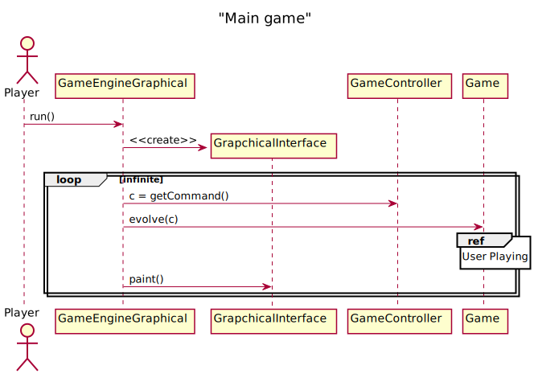

# ACL_2020_InfoDrame

## Compilation et lancement :

Vous pouvez cloner ce projet, le compiler et l'executer en copiant 
et collant les 4 lignes suivantes dans votre terminal

```
git clone https://github.com/TabaryM/ACL_2020_InfoDrame.git
cd ACL_2020_InfoDrame
mvn package
java -jar target\ACL-2020-InfoDrame-0.0-SNAPSHOT.jar
```

## Membres du groupe : 
Corentin Roberge-Mentec

Jordan Scherring

Mathieu Tabary

Paul-Emile Watelot

# Fonctionalitées prévues et découpage par sprint

## Sprint 2
### Objectifs
- 1 Fantômes
    - 1.1 Des monstres sont placés dans l’enclos de départ
    - 1.2 Les monstres se déplacent de manière aléatoire
    - 1.3 Les monstres se déplacent de manière intelligente en essayant d’attraper Pac-Man
    - 1.4 Les fantômes fuient Pac-Man lorsqu’il a mangé l’objet pour les tuer
- 2 Attaques
    - 2.1 Pac-Man est tué au contact d’un fantôme
    - 2.2 Pac-Man peut attaquer les fantômes avec lesquels il est en contact lorsqu’il a mangé l’objet permettant de les tuer. Ceux-ci sont tués à son contact
- 3 Interface graphique : Dessin du monde et des personnages

### Répartition des responsabilité

Corentin et Paul-Emile : 1

Mathieu : 2

Jordan : 3

### Diagrammes
#### Diagramme de classe

#### Diagrammes de séquence

<!---
## Backlog Sprint 2 : 
### Fonctionnalitées implémentées

### Points positifs

### Point Négatifs

### Nouveau diagramme de classe
-->

## Sprint 1
### Objectifs
 - 1 Déplacement du personnage-joueur sur une grille-plateau
 - 2 Affichage d’un HUD contenant les infos suivantes :
 
    - 2.1 Score

    - 2.2 Nombres de vies du joueur
    
- 3 Création de menus
 
    - 3.1. Menu principal

    - 3.2. Menu de pause

- 4 Génération d’un labyrinthe par défaut
 
    - 4.1. Lecture d’un fichier

    - 4.2. Les personnages dans le jeu ne peuvent pas traverser les murs du labyrinthe

    - 4.3. Créations de cases spéciales :

        - 4.3.1. Pièce : Quand traversée par le personnage-joueur, augmente le score

        - 4.3.2. Grosse pièce : Comme pièce + permet de manger les fantômes


### Répartition des responsabilité
Mathieu et Paul-Emile : 1 + 4.1 + 4.2

Corentin + Jordan : 2 + 3. + 4.3

### Diagrammes
#### Diagramme de classe
Objectif d'implémentation : 


#### Diagrammes de séquence
Déroulement du jeu : 




## Backlog Sprint 1 : 

### Fonctionnalitées implémentées
- Construction du plateau de jeu par lecture d'un fichier texte (4.1)
- Création du menu principal (3.1)
- Création d'un menu de pause (3.2)
- Création du HUD (score et vie du joueur) (2)
- Gameplay : 
    - Interface en ligne de commande
    - Déplacement du personnage dans le monde (1) (4.2)
    - Pacman peut ramasser les pièces et augmenter son score (4.3)

### Points positifs
- Bonne utilisation des branches
- Communication efficace
- Temps de travail bien utilisé (3 sessions de 3h environ)

### Point Négatifs
- Diagramme de classe préliminaire pas assez travaillé :
    - Packages mal définis
    - Classes visuelles mal comprises (perte de temps lors de l'implémentation)
- Pas assez d'ambition

### Nouveau diagramme de classe


