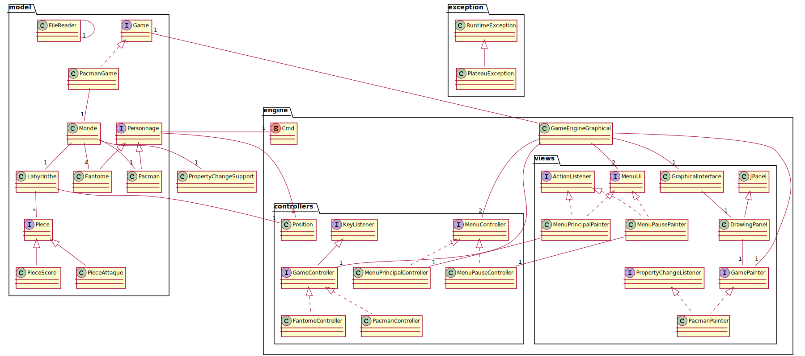

# ACL_2020_InfoDrame

## Compilation et lancement :

Vous pouvez cloner ce projet, le compiler et l'executer en copiant 
et collant les 4 lignes suivantes dans votre terminal

```
git clone https://github.com/TabaryM/ACL_2020_InfoDrame.git
cd ACL_2020_InfoDrame
mvn package
java -jar target\ACL-2020-InfoDrame-0.0-SNAPSHOT.jar
```

## Membres du groupe : 
Corentin Roberge-Mentec

Jordan Scherring

Mathieu Tabary

Paul-Emile Watelot

# Fonctionalitées prévues et découpage par sprint

## Sprint 3
### Objectifs
- 1 Fantomes
    - 1.1 Fantômes piégeurs, un des fantôme tourne dans le sens horaire pour s'approcher de Pacman,
    l'autre dans le sens anti-horaire.
    - 1.2 Fantôme peureux maintient une distance constante entre lui et Pacman,
    et fonce (accélération) sur Pacman quand il s'approche d'une pièce d'attaque.
- 2 Portails entres deux extrémités de la carte.
- 3 Bonus de score
    - 3.1 Serial Killing de Fantômes.
- 4 Animations
    - 4.1 Orientation des personnages.
    - 4.2 Animation de Pacman vivant (à l'arrêt Pacman ne bouge pas,
    en déplacement il ouvre et ferme sa bouche à répétition).
    - 4.3 Animation de mort
- 5 Game design basique
    - Game over quand Pacman perd toutes ses vies.
    - Gain de vie tout les 5000 points.
    - Quand pacman a mangé toutes les pièces, le niveau se recharge.
    - Quand Pacman meurt, les fantômes retournent dans l'enclos (pas de spawn kill svp).

- Fonctionnalités optionnelles :
    - Ajouter de la musique
    - Ajouter des fruits pour augmenter le score
    - Empêcher les échanges de places entre un fantôme et Pacman <!-- Mémoire de la position avant déplacement-->

<!--
Idée : augmenter la difficulté
-->
### Répartition des responsabilité
Corentin et Paul-Emile : 1

Jordan : 4

Mathieu : 3 et 5

## Sprint 2
### Objectifs
- 1 Fantômes
    - 1.1 Des monstres sont placés dans l’enclos de départ
    - 1.2 Les monstres se déplacent en essayant d’attraper Pac-Man
        - 1.2.1 A* (plus court chemin) entre le fantôme et Pac-Man
        - 1.2.2 Deux fantômes "piégeurs" qui essaient d'encercler Pac-Man
        - 1.2.3 Fantôme qui maintient une distance constante avec Pac-Man,
        mais à un élan de courage trop tard (quand Pac-Man va manger la Pièce-Attaque).
    - 1.3 Les fantômes fuient Pac-Man lorsqu’il a mangé l’objet pour les tuer
- 2 Attaques
    - 2.1 Pac-Man est tué au contact d’un fantôme
    - 2.2 Pac-Man peut attaquer les fantômes avec lesquels il est en contact
    lorsqu’il a mangé l’objet permettant de les tuer. Ceux-ci sont tués à son contact
- 3 Interface graphique : Dessin du monde et des personnages

### Répartition des responsabilité

Corentin et Paul-Emile : 1

Mathieu : 2

Jordan : 3

### Diagrammes
#### Diagramme de classe
Objectif d'implémentation : 



#### Diagrammes de séquence
Cas de déplacement avec attaque possible : 


## Backlog Sprint 2 : 
<!-- TODO ajouter des images 
-->
### Fonctionnalités implémentées
- Les fantômes apparaissent dans l'enclos de départ. (1.1)
- Le fantôme pisteur va vers Pacman en suivant un des plus court chemin. (1.2.1)
- Les fantômes fuient Pacman quand il a mangé une pièce d'attaque. (1.3)
- Les fantômes tuent Pacman quand ils sont sur la même case que lui. (2.1)
- Si Pacman a mangé la pièce d'attaque,
il tue les fantômes s'ils sont sur la même case que lui. (2.2)
- Les personnages et le labyrinthe sont affiché en temps réel sur l'interface graphique. (3)

### Points positifs
- Bonne répartition des taches (équitable en temps de travail) (très peu de conflits lors de merges)
- Bonne gestion des branches (toujours aucune perte de données)

### Point Négatifs
- Mauvaise préparation du sprint
    - Diagramme de classe incomplet (Factory, Cases)
    - Classes définies au sprint précédent inappropriées
    à l'implémentation des fonctionnalités de ce sprint

### Nouveau diagramme de classe


## Sprint 1
### Objectifs
 - 1 Déplacement du personnage-joueur sur une grille-plateau
 - 2 Affichage d’un HUD contenant les infos suivantes :
 
    - 2.1 Score

    - 2.2 Nombres de vies du joueur
    
- 3 Création de menus
 
    - 3.1. Menu principal

    - 3.2. Menu de pause

- 4 Génération d’un labyrinthe par défaut
 
    - 4.1. Lecture d’un fichier

    - 4.2. Les personnages dans le jeu ne peuvent pas traverser les murs du labyrinthe

    - 4.3. Créations de cases spéciales :

        - 4.3.1. Pièce : Quand traversée par le personnage-joueur, augmente le score

        - 4.3.2. Grosse pièce : Comme pièce + permet de manger les fantômes


### Répartition des responsabilité
Mathieu et Paul-Emile : 1 + 4.1 + 4.2

Corentin + Jordan : 2 + 3. + 4.3

### Diagrammes
#### Diagramme de classe
Objectif d'implémentation : 


#### Diagrammes de séquence
Déroulement du jeu : 


## Backlog Sprint 1 : 

### Fonctionnalitées implémentées
- Construction du plateau de jeu par lecture d'un fichier texte (4.1)
- Création du menu principal (3.1)
- Création d'un menu de pause (3.2)
- Création du HUD (score et vie du joueur) (2)
- Gameplay : 
    - Interface en ligne de commande
    - Déplacement du personnage dans le monde (1) (4.2)
    - Pacman peut ramasser les pièces et augmenter son score (4.3)

### Points positifs
- Bonne utilisation des branches
- Communication efficace
- Temps de travail bien utilisé (3 sessions de 3h environ)

### Point Négatifs
- Diagramme de classe préliminaire pas assez travaillé :
    - Packages mal définis
    - Classes visuelles mal comprises (perte de temps lors de l'implémentation)
- Pas assez d'ambition

### Nouveau diagramme de classe


